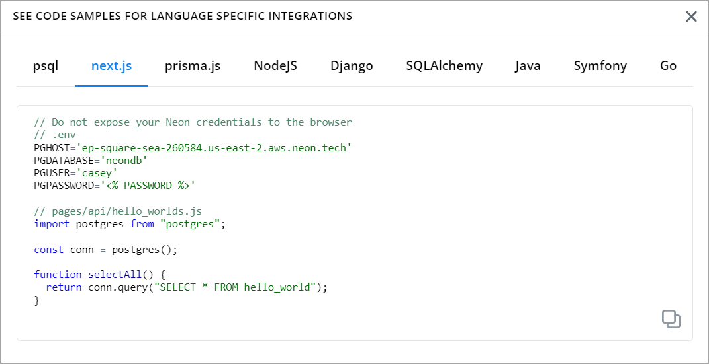

When developing an application, you will need to connect to a database in your Neon project. In Neon, a database belongs to a branch, which can be the root branch of your Neon project (`main`) or a child branch. You can create databases any branch.

```text
Neon project
    |------root branch (main)
               |
               |------ database
               |
          child branch
               |
               |------ database
```

In order to connect to a database, you must connect to the branch where the database resides, and you must do so by connecting through an endpoint, which is the compute instance associated with the branch.

```text
Neon project
    |------root branch (main) ---- endpoint (compute) <--- application
               |
               |------ database
               |
          child branch ---- endpoint (compute) <--- application
               |
               |------ database  
```

You can obtain the connection details for a branch from the **Connection Details** widget on the **Neon Dashboard**. Select a branch, a user, and the database you want to connect to. A connection string is constructed for you, which contains the details required to configure a database connection in your application.


Either the connection string itself or details from the connection string can be used configure a database connection. For example, connection details might be placed in an `.env` file or a connection variable. Given the following connection string, an `.env` file or a `DATABASE_URL` variable can be configured as shown.

Connection string:

```text
postgres://casey@ep-polished-water-579720.us-east-2.aws.neon.tech/main
             ^                    ^                                 ^
             | - <user>           |- <endpoint_hostname>            |- <database>                         
```

`.env` file:

```text
PGHOST='ep-polished-water-579720.us-east-2.aws.neon.tech:5432'
PGDATABASE='main'
PGUSER='casey'
PGPASSWORD='<password>'
```

`DATABASE_URL` variable:

```text
DATABASE_URL="postgres://casey:ep-polished-water-579720.us-east-2.aws.neon.tech/main"
```

<Admonition type="tip">
For additional information about Neon connection strings and what comprises them, see [Connection strings](../connection-strings).
</Admonition>

## Passwords

A password is provided for the initial database user that was created when you created your Neon project. A password is also also provided when you create a new database user. If you have misplaced a password, refer to [Users](tbd) for password reset instructions.

## Application and framework connection examples

The **Connection Details** widget on the **Neon Dashboard** provides connection examples for different languages and frameworks, constructed for the branch, database, and user that you select. Click **connection examples**  in the **Connection Details** widget to view or copy them.



Connection examples for various languages and frameworks are also provided in our *Guides* section.
