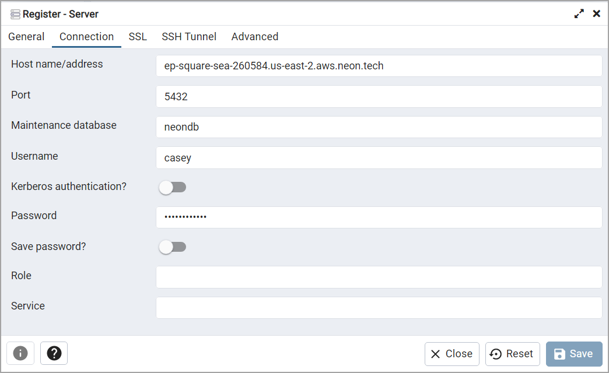

This topic describes how to connect to a Neon database using a PostgreSQL GUI. This guide uses `pgAdmin` as an example, but many GUI applications that that support connecting to a standalone PostgreSQL database also support connecting to a Neon database.

## Retrieve your connection details

To connect to a Neon database, the following connection details are required:

- Hostname
- User name
- Database name
- Password

You can obtain the connection details that you require from the **Connection Details** widget on the **Neon Dashboard**. Select a branch, a user, and the database you want to connect to. A connection string is constructed for you.


A Neon connection string includes the user, the hostname, and the database name.

```text
postgres://casey@ep-square-sea-260584.us-east-2.aws.neon.tech/neondb
             ^                       ^                          ^
             |- <user>               |- <hostname>     |- <database>


From the connection string, you can obtain the required connection details with the exception of the password:

```text
Hostname: ep-square-sea-260584.us-east-2.aws.neon.tech
User name: casey
Database name: neondb
Password: <password>
```

For security reasons, passwords are only shown when they are created. If you misplaced your password, you can reset it by selecting **Reset Password** link in the COnnection Details widget, or by navigating to **Settings** > **Users**.

Should a port number be required, Neon always uses the default port, `5432`.

## Connect to the database

In the GUI application, enter the connection details you gathered into the appropriate fields and connect. In PgAdmin 4, clicking **Save** establishes the connection.



If the connection was successful, you should be able to view and query your database.

## Tested GUI applications

Connections from the following GUI applications have been successfully tested with Neon:

- [pgAdmin 4](https://www.pgadmin.org/)
- [DBeaver](https://dbeaver.io/)
- [DataGrip](https://www.jetbrains.com/datagrip/)
- [TablePlus](https://tableplus.com/)
- [DronaHQ](https://www.dronahq.com/)
- [PostgreSQL VS Code Extension by Chris Kolkman](https://marketplace.visualstudio.com/items?itemName=ckolkman.vscode-postgres)