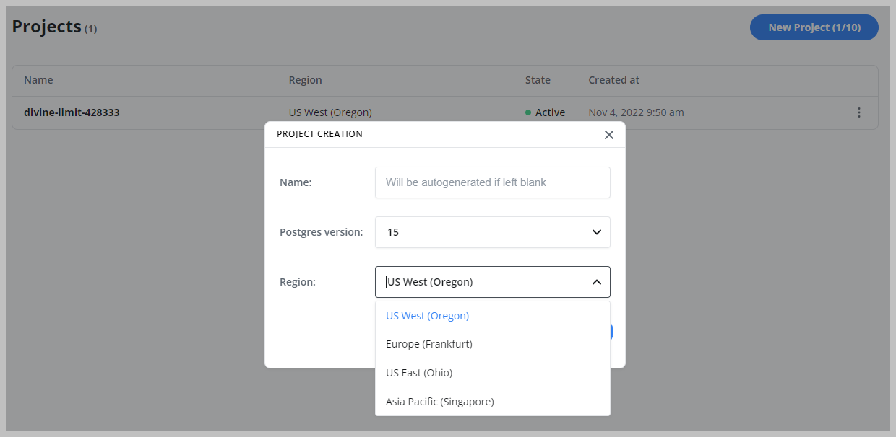

You can select a region during Neon project creation.

## Overview

Neon offers project deployment in multiple regions. It is recommended that you select the region that is closest to your application servers to reduce latency between your Neon project and your application.

## Available regions

Neon currently supports the following AWS regions:

- Asia Pacific (Singapore) Region &mdash; ap-southeast-1
- Europe (Frankfurt) Region &mdash; eu-central-1
- US East (Ohio) Region &mdash;  us-east-2
- US West (Oregon) Region &mdash; us-west-2

## Select a region for your Neon project

Neon allows you to select the region for a Neon project during project creation. All databases created in a Neon project are created in the region selected for the project.

_**Note**_ Once you select region for a Neon project, it cannot be changed.

## Moving project data to a new region

Once you select a region for a Neon project, it cannot be changed.

If you need to move your data to a different region, the following steps are recommended:

1. Create a new project in the new region. For project creation instructions, see [Setting up a project](../setting-up-a-project).
1. Dump and restore data from your old project to the new project. For instructions, see [Import data from PostgreSQL](../../how-to-guides/import-an-existing-database).

This procedure may require downtime if performed on a production database, as the dump and restore procedure may take some time to complete. To avoid losing data, consider temporarily blocking writes from your applications before dumping data, and re-enable writes after the data migration is finished.
