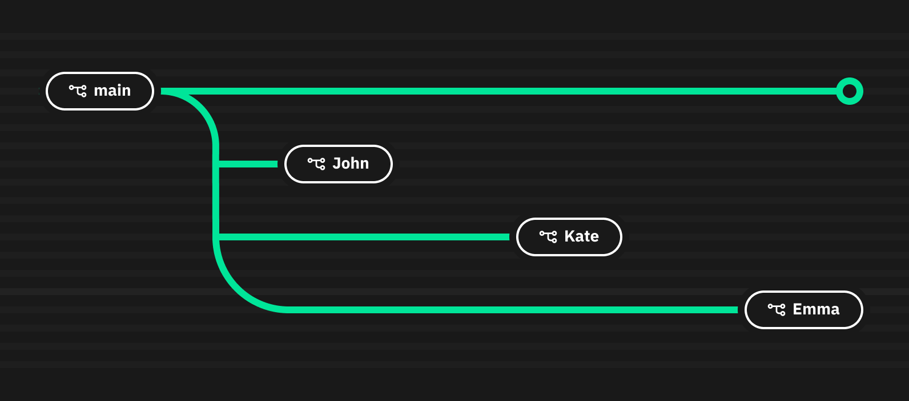
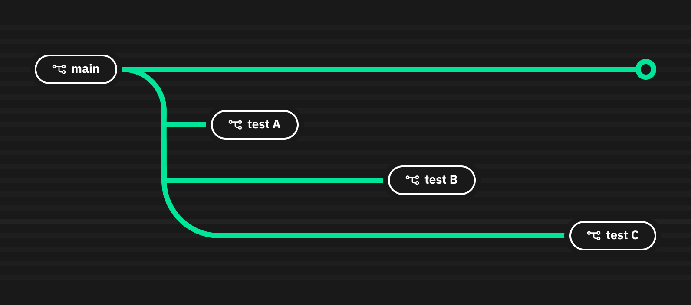
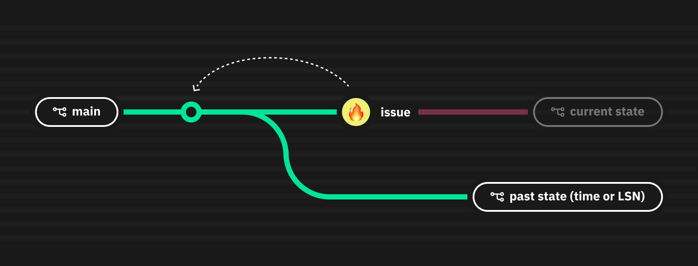
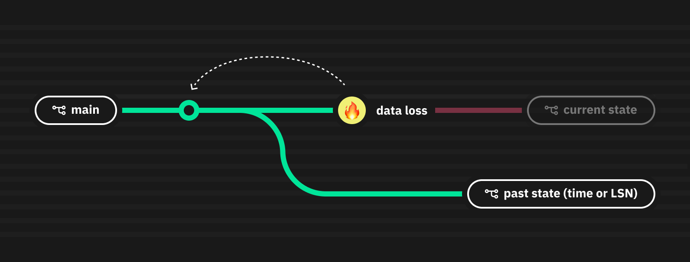
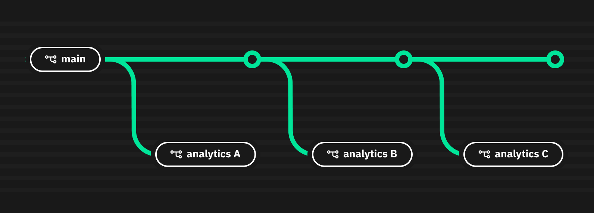

Neon allows you to instantly branch your data in the same way that you branch your code. You can quickly and cost-effectively branch your data for development, testing, staging, and various of other purposes, enabling you to improve developer productivity and optimize continuous integration and delivery (CI/CD) pipelines. See [Branching workflows](#branching-workflows) for a discussion of different ways you can integrate branching into your development workflows.

## What is a branch?

A branch is a copy-on-write clone of your data. You can create a branch from a current or past state. For example, you can create a branch that includes all data up to the current point in time or an earlier point in time.

A branch is isolated from its originating data, so you are free to play around with it, modify it, and delete it when it's no longer needed. Changes to a branch are independent. A branch and its parent share the same history but diverge at the point of branch creation. Writes to a branch are saved as a delta.

Creating a branch does not increase load on the parent branch or affect it in any way, which means you can create a branch at any time without impacting the performance of your production system.

Each Neon project has a [root branch](../../reference/glossary#root-branch) called `main`. The first branch that you create is branched from the project's root branch (`main`). Subsequent branches can be branched from `main` or from a previously created branch.

## Branch endpoints

Each branch is created with an endpoint, which is the compute instance associated with the branch. Branch endpoints are read-write.

Your Neon project's [root branch](../../reference/glossary#root-branch) (`main`) also has an endpoint.

To connect to a database in a branch from a client or application, you must connect to the branch's endpoint. For more information connecting to a branch endpoint, see [Connect to a branch](../../manage/branches/#connect-to-a-branch).

## Branching workflows

You can use Neon's branching feature in variety development workflows, a few of which are discussed below.

### Development

Create a branch of your production database that developers are free to play with and modify. You can quickly create a branch with all of the data that existed in the parent branch, eliminating the setup time required to deploy and maintain a development database. 

Branching is so easy and cost-effective that you can create a branch for each developer. For example, you can create branches from a primary development branch to assign tasks to be worked on in parallel.

### Testing

Branching enables testers to use the most recent production data. Testers can create branches for testing schema changes, validating new queries, or testing potentially destructive queries before deploying them into production. A branch is isolated from its parent branch but has all of the parent branch's data up to the point of branch creation, which eliminates the effort involved in hydrating a database. Tests can also run on separate branches in parallel, with each branch having dedicated compute resources.

Another testing scenario enabled by branching is tracking down corruption or data quality issues. For example, you can create and dispose of multiple point-in-time branches to determine when a corruption or data quality issue first appeared.

### Data recovery

If you lose data due to an unintended deletion or some other event, you can create a branch with data as it existed before the event occurred, allowing you to recover the lost data.

### Analytics

You can run costly, long-running queries on an isolated branch of your production data, each with its own compute resources. With automation scripts, you can create and dispose of branches on a defined schedule to ensure that queries always run on an up-to-date copy of your production data.

### Machine Learning

You can create point-in-time branches to ensure repeatability when training machine learning models.

### Staging

With Neon's branching capabilities, you can create a staging database by branching your production database. Using the Neon API, you can automate creating a database branch based on the staging branch for every pull request in your CI/CD pipeline.

### Backups

You can use branching to implement a data backup strategy. For example, you can create backup branches named for the time they were created for convenient point-in-time restore (PITR).

## Get started with branching

To start using branches, refer to the instructions in [Branches](../../get-started-with-neon/get-started-branching).
